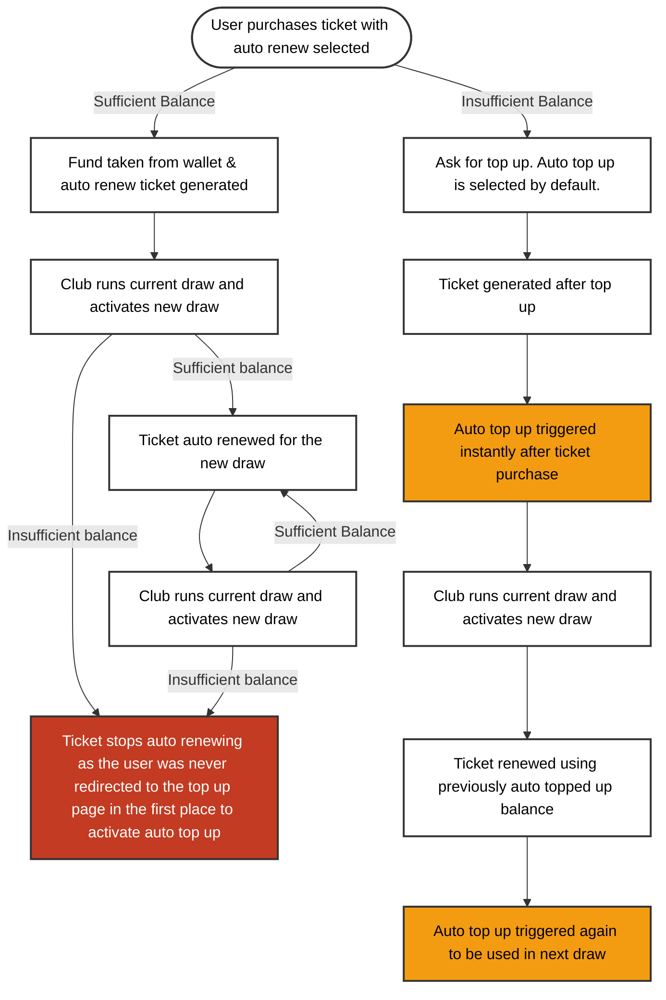
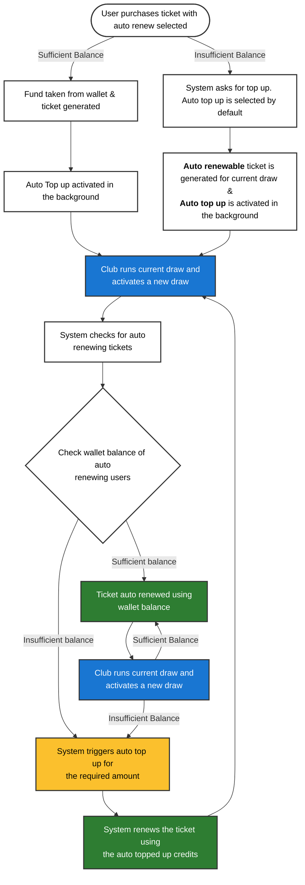

# Case Study: Subscription & Billing Engine Optimization

**Role:** Lead Requirements Analyst & QA Engineer  
**Core Objective:** Resolve "double-charging" perceptions and silent renewal failures by merging the Auto-Renew and Auto-Top-Up logic.

## 1. Problem Diagnosis: The Legacy Flow
The legacy system treated Auto-Renew (recurring ticket subscription) and Auto-Top-Up (financial replenishment of wallet balance whenever it dipped below €5.00 ) as separate entities, leading to critical issues:
* **The "Double Charge" Illusion:** Users purchasing a recurring ticket triggered an instant Auto-Top-Up as most the time the wallet balance dropped below €5.00 after successful purchase, resulting in perceived double charges and reputational damage.
* **The "Silent Failure" Trap:** Users with sufficient initial balances never triggered Auto-Top-Up. Once balances exhausted, renewals failed silently.
* **Inaccurate Scaling:** Disabling active tickets did not reduce the Auto-Top-Up amount, over-charging users whenever the balance dipped below 5.00
### Visual Logic: The Legacy Flow

## 2. The Solution: Unified Subscription Logic
I proposed a "Post-Draw Settlement" model. The core requirement shifted from instant triggering to conditional background activation.
**Key Logic Adjustments:**
* **Unified Activation:** Selecting Auto-Renew automatically enables background Auto-Top-Up for that ticket amount, regardless of current balance.
* **Post-Draw Validation:** The system checks for renewing tickets *after* a draw is activated, triggering top-ups only for the exact shortfall amount.
* **Dynamic Adjustment:** Disabling Auto-Renew dynamically reduces the top-up requirement.
### Visual Logic: The Proposed Flow

### Visual Logic: The Updated Proposed Flow

## 3. Scenario-Based Requirements Mapping
To ensure 100% test coverage, I defined four primary logic scenarios to guide development and QA:

| Scenario | User Condition | Expected System Flow |
| :--- | :--- | :--- |
| **1. Shortfall** | 10 balance for 30 ticket. | Prompt for 20 top-up initially; ensure future top-ups pull the full 30 when the next draw activates. |
| **2. Precise Balance** | 10 balance for 10 ticket. | Enable Auto-Top-Up in the background automatically so the next renewal doesn't fail. |
| **3. Surplus Balance** | 20 balance for 5 ticket. | Use wallet balance for the first 4 draws; trigger Auto-Top-Up only when the balance becomes insufficient. |
| **4. Subscription Change** | Disabling 2 out of 3 active tickets. | Dynamically reduce the top-up amount to match only the remaining active ticket. |

## 4. QA & Business Impact
* **Reputation Management:** By eliminating the “balance is less than €5.00” condition of legacy Auto Top Up system, we removed the primary source of "scam" complaints and the need for clubs to process manual refunds.
* **Shift-Left Testing:** By defining these scenarios during the requirements phase, the QA team validated the merged logic across all balance types without mid-cycle requirement changes.
* **Opened Doors to More Options:** By implementing new auto renewing system, users now can renew any ticket they want to, whether it's a single draw ticket or an annual ticket.
* **Sustainability:** Our customers (clubs and organisations) can now maintain sustainable revenue streams through reliable, automated renewals without manual intervention.
* **Operational Visibility:** Introduced a mandatory failed-renewal report for clubs, allowing them to proactively contact supporters if a payment fails.
